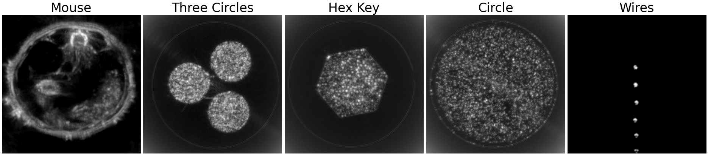

pyruct
=======================================================

[](https://ieeexplore.ieee.org/document/9768674)
[](https://berkanlafci.github.io/pyruct/)
[](https://zenodo.org/record/6541837#.YrwSZXhByEI)
[](https://mit-license.org/)  

Python Package for Reflection Ultrasound Computed Tomography (RUCT) Delay And Sum (DAS) Beamforming

Paper : [IEEE TUFFC Link](https://ieeexplore.ieee.org/document/9768674)  
Documentation: [Website Link](https://berkanlafci.github.io/pyruct/)  
Data : [Zenodo Link](https://zenodo.org/record/6541837#.YrwUoHhByEJ)  



Latest package release:  
[](https://doi.org/10.5281/zenodo.5599811)

Public dataset:  
[](https://doi.org/10.5281/zenodo.6541837)

The imaging setup is explained in the following paper [Lafci, B. et al.](https://ieeexplore.ieee.org/document/9768674) Synthetic Transmit Aperture (STA) method for pulse-echo ultrasound was used in data acquisition. All images were reconstructed using Delay And Sum (DAS) algorithm and compounded to create final high contrast images.

Installation
-------------------------------------------------------
This project uses pip package manager. Please run the following command in your terminal to install the package.
```bash
pip install git+https://github.com/berkanlafci/pyruct.git
```

Usage
-------------------------------------------------------
After installing package, the functions can be called using python scripts.

Example scripts to use pyruct package can be found in _examples folder.

For example, delay and sum example on cpu is called with following commands in terminal.
```bash
python exampleCpuDAS.py
```
The example scripts can be written by users.

pyruct package can be imported in python scripts using following line.
```python
import pyruct as pt
```
After importing the package, the functions can be called with following lines in python script.
```python
usData      = pt.usReader(filePath=filePath) 	# read data
das         = pt.cpuDAS()                      	# create reconstruction object
imageRecon  = das.recon(usData.sigMat)         	# reconstruct image
```

Data
-------------------------------------------------------
Test data is publicly available [here](https://doi.org/10.5281/zenodo.5599242).

After the download, place the data in "data/rawData/" folder that shares the same root directory with "exampleCpuDAS.py" script that can be run for testing "pyruct".

Citation
-------------------------------------------------------
If you use this package and/or data in your research, please cite the following paper.

```
@article{lafci2022expediting,
  author      = {Lafci, Berkan and 
                Robin, Justine and 
                Deán-Ben, Xosé Luís and 
                Razansky, Daniel},
  title       = {Expediting Image Acquisition in Reflection Ultrasound Computed Tomography},
  journal     = {IEEE Transactions on Ultrasonics, Ferroelectrics, and Frequency Control},
  year        = {2022},
  volume      = {69},
  number      = {10},
  pages		  = {2837-2848},
  doi         = {10.1109/TUFFC.2022.3172713}
}
```

Acknowledgements
-------------------------------------------------------
This project is supported by Swiss Data Science Center (SDSC) grant C19-04.

License
-------------------------------------------------------
This project is licensed under [MIT License](https://mit-license.org/).